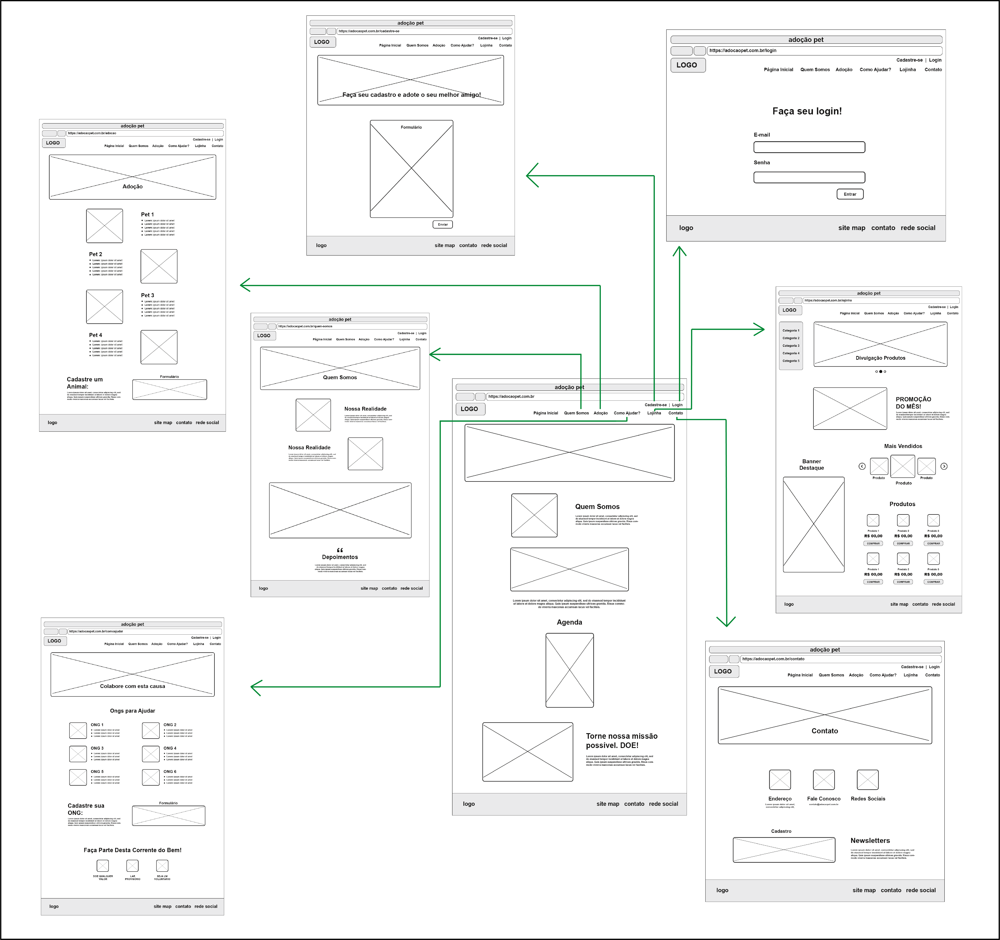

# Projeto de Interface

Apresentamos aqui a visão geral da interação do usuário através das telas do sistema, bem como os protótipos das telas com as suas funcionalidades.

## User Flow

## Wireframes

**Tela 1 - Página Inicial**

Página inicial do site com um breve texto contando quem somos, agenda com os eventos e uma forma de doar para ajudar a missão.

**Tela 2 - Login**

Login para os usuários cadastrados entrarem em seu perfil. 

**Tela 3 - Cadastro usuário**

Formulário para os usuários cadastrarem-se no site.

**Tela 4 - Quem somos**

Onde ficara as informações sobre o projeto de adoção.

**Tela 5 - Adoção**

Onde fica as fotos e informações dos pets disponíveis para adoção e logo abaixo o formulário para cadastrar novos animais.

**Tela 6 - Como ajudar**

Lista de Ongs cadastradas que estão precisando de ajuda, um formulário para cadastrar novas Ongs e outras formas de ajudar o projeto de adoção .

**Tela 7 - Lojinha**

Loja virtual que ajudará o projeto com o dinheiro das vendas.

**Tela 8 - Contato**

Informações para contato por endereço, e-mail e/ou redes sociais e abaixo o cadastro da nossa Newsletters.

