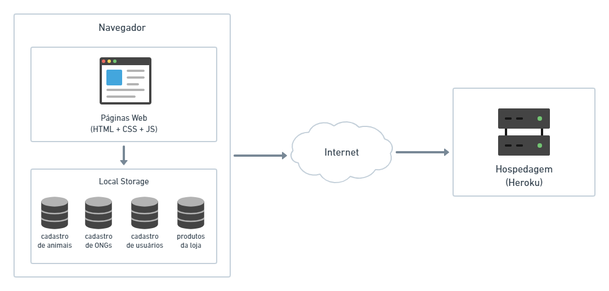

# Arquitetura da Solução

Apresentaremos aqui a definição dos componentes do nosso site e nossa solução de hospedagem.

## Diagrama de componentes

Figura 01 - Arquitetura da Solução

 

A solução implementada conta com os seguintes módulos:
- **Navegador** - Interface básica do sistema  
  - **Páginas Web** - Conjunto de arquivos HTML, CSS, JavaScript e imagens que implementam as funcionalidades do sistema.
   - **Local Storage** - armazenamento mantido no Navegador, onde são implementados bancos de dados baseados em JSON. São eles: 
     - **Cadastro de animais** - cadastro de animais disponíveis para adoção
     - **Cadastro de ONGs** - cadastro de ONGs parceiras
     - **Cadastro de usuários** - cadastro de pessoas interessadas em adotar animais
     - **Produtos da loja** - itens disponíveis para venda
 - **Hospedagem** - Nosso site será hospedado no servidor gratuito Heroku.

## Tecnologias Utilizadas

Em nosso projeto, iremos utilizar as seguintes tecnologias:

- **HTML 5** - A estrutura básica do site (texto, inserção de imagens, separação em containers) será feita em HTML.
- **CSS 3** - A estilização do site será feita em CSS, com possível utilização de frameworks como Bootstrap.
- **JavaScript** - Utilizaremos a linguagem JavaScript para inserir elementos de interação no site.
- **Git** - Será utilizado para realização do controle de versão dos documentos do projeto.
- **GitHub** - Será utilizado como repositório remoto do código-fonte e como ferramenta de gerenciamento de projeto.
- **Photoshop** - Será utilizado na elaboração do Projeto de Interfaces e Wireframes e no tratamento das imagens que compõem o site.
- **Visual Studio Code** - Editor de código.
- **Google Slides** - Utilizado na elaboração de apresentações.
- **Heroku** - Será utilizado para hospedagem do site.

Descreva aqui qual(is) tecnologias você vai usar para resolver o seu problema, ou seja, implementar a sua solução. Liste todas as tecnologias envolvidas, linguagens a serem utilizadas, serviços web, frameworks, bibliotecas, IDEs de desenvolvimento, e ferramentas.

Apresente também uma figura explicando como as tecnologias estão relacionadas ou como uma interação do usuário com o sistema vai ser conduzida, por onde ela passa até retornar uma resposta ao usuário.

## Hospedagem

Heroku é uma plataforma em nuvem que permite que os desenvolvedores implantem e gerenciem aplicações. Nós a escolhemos por sua boa usabilidade e por ser totalmente gerenciada - assim não teremos preocupações com manutenção de servidores. Além disso, a plataforma oferece a opção de hospedagem grátis que é ideal para o nosso projeto que está sendo desenvolvido em ambiente escolar.

> **Links Úteis**:
>
> - [Website com GitHub Pages](https://pages.github.com/)
> - [Programação colaborativa com Repl.it](https://repl.it/)
> - [Getting Started with Heroku](https://devcenter.heroku.com/start)
> - [Publicando Seu Site No Heroku](http://pythonclub.com.br/publicando-seu-hello-world-no-heroku.html)