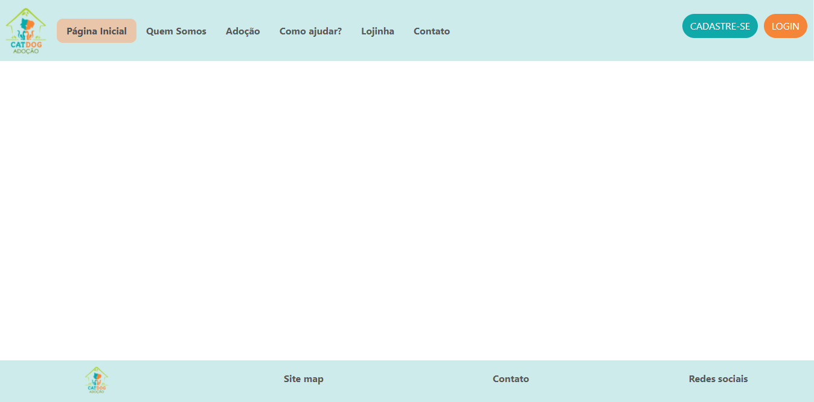

# Template padrão do site

O  padrão  de  layout  utilizado  para a criação do site será de acordo com a imagem abaixo.
A responsividade segue o padrão do Bootstrap

**Tela 1 - Página Inicial**

billa.com/blog/how-and-why-icons-improve-you-web-design/)